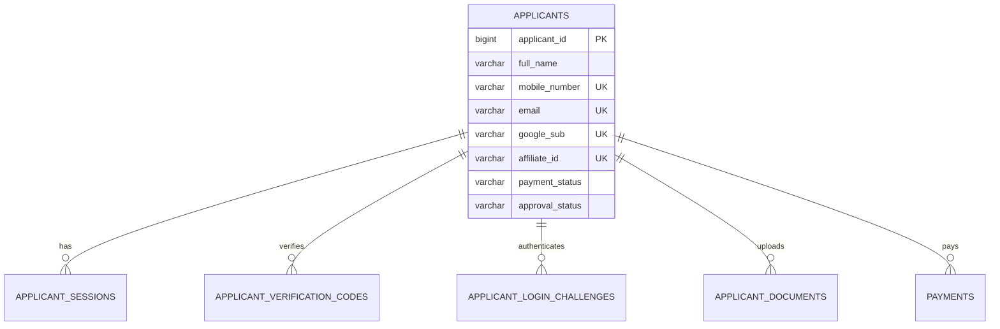

# Database Design

MySQL 8 schema `zaylope` managed via Flyway (`V1`–`V13`) with `spring.jpa.hibernate.ddl-auto=none`.

```mermaid
erDiagram
    APPLICANTS ||--o{ APPLICANT_SESSIONS : has
    APPLICANTS ||--o{ APPLICANT_VERIFICATION_CODES : verifies
    APPLICANTS ||--o{ APPLICANT_LOGIN_CHALLENGES : authenticates
    APPLICANTS ||--o{ APPLICANT_DOCUMENTS : uploads
    APPLICANTS ||--o{ PAYMENTS : pays
    APPLICANTS {
        bigint applicant_id PK
        varchar full_name
        varchar mobile_number UK
        varchar email UK
        varchar google_sub UK
        varchar affiliate_id UK
        varchar payment_status
        varchar approval_status
    }
```
